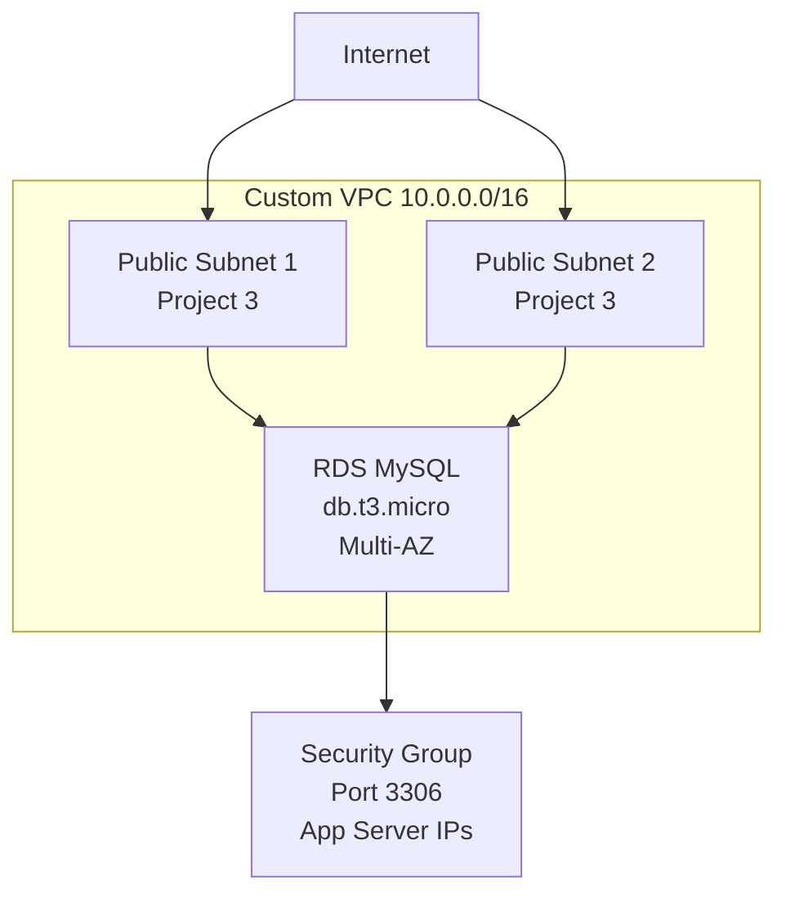

# Terraform Project 4: RDS Database Instance

[
[

## 🎯 Project Overview

**Level:** Beginner (Project #4/30)  
**Estimated Time:** 35 minutes  
**Cost:** ~$0.025/hour (db.t3.micro) **Free Tier eligible**  
**Real-World Use Case:** Application databases, WordPress/MySQL backends, dev/test DBs

This project creates a **production-ready RDS instance** integrated with **Project 3 VPC**:
- MySQL 8.0 database with Multi-AZ standby
- **DB Subnet Group** (public subnets from Project 3)
- Encrypted storage with automated backups
- Security Group (app server access only)
- Parameter group for performance tuning
- Secrets rotation ready

## 📋 Table of Contents
- [Features](#features)
- [Architecture](#architecture)
- [Prerequisites](#prerequisites)
- [Quick Start](#quick-start)
- [File Structure](#file-structure)
- [Complete Code](#complete-code)
- [Industry Best Practices](#industry-best-practices)
- [Real-time Interview Questions](#real-time-interview-questions)
- [Testing](#testing)
- [Clean Up](#clean-up)

## ✨ Features

| Feature | Implemented | Terraform Resource |
|---------|-------------|-------------------|
| RDS MySQL Instance | ✅ | `aws_db_instance` |
| **DB Subnet Group** | ✅ | `aws_db_subnet_group` |
| **Security Group** | ✅ | `aws_security_group` |
| Encrypted Storage | ✅ | `storage_encrypted = true` |
| Automated Backups | ✅ | `backup_retention_period = 7` |
| Multi-AZ Failover | ✅ | `multi_az = true` |
| Parameter Group | ✅ | `aws_db_parameter_group` |
| Custom Password | ✅ | `password = random_password` |

## 🏗️ Architecture *(Integrated with Project 3 VPC)*



## 🛠️ Prerequisites

```bash
# 1. Deploy Project 3 first (VPC + subnets)
cd ../03-vpc-public-subnet
terraform apply

# 2. Copy VPC outputs
VPC_ID=<from-project3> 
SUBNET1=<public_subnet_1_id>
SUBNET2=<public_subnet_2_id>

# 3. Required IAM permissions
- rds:CreateDBInstance, ModifyDBInstance
- ec2:CreateSecurityGroup, AuthorizeSecurityGroupIngress
```

## 🚀 Quick Start

```bash
# Navigate to project
cd Terraform-30-projects/projects/beginner/04-rds-mysql-instance

# Configure VPC details from Project 3
cat <<EOF > terraform.tfvars
vpc_id              = "vpc-xxx"
public_subnet_ids   = ["subnet-xxx", "subnet-yyy"]
EOF

# Deploy RDS
terraform init
terraform plan
terraform apply

# Save connection details
terraform output db_connection_string > db-creds.txt
```

## 📁 File Structure

```
04-rds-mysql-instance/
├── main.tf              # RDS + networking
├── variables.tf         # VPC integration vars
├── outputs.tf           # Connection strings
├── versions.tf          # Provider lock
├── terraform.tfvars.example
├── README.md
└── .gitignore
```

## 💻 Complete Code *(Production Ready)*

### **versions.tf**
```hcl
terraform {
  required_version = ">= 1.5.0"
  required_providers {
    aws = {
      source  = "hashicorp/aws"
      version = "~> 5.40"
    }
    random = {
      source  = "hashicorp/random"
      version = "~> 3.6"
    }
  }
}
```

### **variables.tf** *(VPC Integration)*
```hcl
variable "vpc_id" {
  description = "VPC ID from Project 3"
  type        = string
}

variable "public_subnet_ids" {
  description = "Public subnet IDs from Project 3"
  type        = list(string)
  validation {
    condition     = length(var.public_subnet_ids) >= 2
    error_message = "Need at least 2 subnets for Multi-AZ."
  }
}

variable "environment" {
  type    = string
  default = "dev"
}

variable "db_name" {
  description = "Initial database name"
  type        = string
  default     = "terraform_app"
}
```

### **main.tf** *(Multi-AZ RDS)*
```hcl
provider "aws" {
  region = var.aws_region
}

# Generate secure DB password
resource "random_password" "db_password" {
  length  = 16
  special = true
}

# Custom parameter group for MySQL 8.0
resource "aws_db_parameter_group" "mysql_params" {
  family = "mysql8.0"

  parameter {
    name  = "character_set_server"
    value = "utf8mb4"
  }

  parameter {
    name  = "collation_server"
    value = "utf8mb4_unicode_ci"
  }

  tags = var.default_tags
}

# DB Subnet Group (uses Project 3 subnets)
resource "aws_db_subnet_group" "main" {
  name       = "${var.environment}-tf-rds-subnet-group"
  subnet_ids = var.public_subnet_ids

  tags = var.default_tags
}

# RDS Security Group (App → DB)
resource "aws_security_group" "rds_sg" {
  name_prefix = "tf-rds-${var.environment}-"
  vpc_id      = var.vpc_id

  ingress {
    description = "MySQL from app servers"
    from_port   = 3306
    to_port     = 3306
    protocol    = "tcp"
    cidr_blocks = ["10.0.0.0/16"]  # VPC CIDR
  }

  egress {
    from_port   = 0
    to_port     = 0
    protocol    = "-1"
    cidr_blocks = ["0.0.0.0/0"]
  }

  tags = var.default_tags
}

# Production RDS Instance (Multi-AZ)
resource "aws_db_instance" "main" {
  identifier             = "${var.environment}-tf-mysql"
  engine                 = "mysql"
  engine_version         = "8.0"
  instance_class         = "db.t3.micro"
  
  allocated_storage     = 20
  max_allocated_storage = 1000
  storage_type          = "gp2"
  storage_encrypted     = true
  
  db_name  = var.db_name
  username = "admin"
  password = random_password.db_password.result

  vpc_security_group_ids = [aws_security_group.rds_sg.id]
  db_subnet_group_name   = aws_db_subnet_group.main.name
  parameter_group_name   = aws_db_parameter_group.mysql_params.name

  # Production settings
  multi_az               = true
  publicly_accessible    = false
  backup_retention_period = 7
  backup_window          = "03:00-04:00"
  maintenance_window     = "Sun:00:00-Sun:03:00"
  skip_final_snapshot    = true

  tags = merge(var.default_tags, {
    Name = "${var.environment}-mysql-tf"
  })
}
```

### **outputs.tf** *(Secure Connection)*
```hcl
output "db_connection_string" {
  description = "Full MySQL connection string"
  value       = "mysql://${aws_db_instance.main.username}:${random_password.db_password.result}@${aws_db_instance.main.endpoint}"
  sensitive   = true
}

output "db_endpoint" {
  description = "RDS endpoint"
  value       = aws_db_instance.main.endpoint
}

output "db_username" {
  value     = aws_db_instance.main.username
  sensitive = true
}

output "db_password" {
  value     = random_password.db_password.result
  sensitive = true
}

output "db_port" {
  value = aws_db_instance.main.port
}
```

## 🏆 Industry Best Practices Applied

| Practice | Why Implemented |
|----------|----------------|
| ✅ **Multi-AZ** | Automatic failover (6 min RTO) |
| ✅ **Encryption** | Data at rest (KMS optional) |
| ✅ **Backups** | 7 days Point-in-Time Recovery |
| ✅ **Parameter Group** | UTF8 + performance tuning |
| ✅ **Auto Scaling Storage** | `max_allocated_storage = 1000` |
| ✅ **Least Privilege SG** | VPC CIDR only (10.0.0.0/16) |
| ✅ **Random Passwords** | 16 chars + special characters |

## 💬 Real-time Interview Questions

### **🔥 Most Asked (Production RDS)**
```
Q1: Multi-AZ vs Read Replica?
A: Multi-AZ = HA failover (sync). Read Replica = scale reads (async).

Q2: Why db_subnet_group_name over subnet_ids?
A: RDS requires dedicated subnet group resource.

Q3: Storage auto-scaling trigger?
A: 10% free space remaining → auto increases 5-100GB increments.
```

### **🎯 Architecture Design**
```
Q4: Production RDS setup for 99.99% uptime?
A: Multi-AZ + Read Replicas + Auto Patch + Performance Insights + KMS.

Q5: Migrate from single-AZ to Multi-AZ?
A: ModifyDBInstance → true (creates standby, no downtime).
```

## 🧪 Testing Your Deployment

```bash
# Get connection details
eval $(terraform output -json | jq -r '.db_connection_string.value | split(":") | .[1:] | join(":")')

# Test connection (install mysql client first)
mysql -h $(terraform output -raw db_endpoint) -u admin -p

# Verify Multi-AZ
aws rds describe-db-instances --db-instance-identifier dev-tf-mysql --query 'DBInstances[0].[MultiAZ,ReadReplicaDBInstanceIdentifiers]'

# Test backup
aws rds describe-db-snapshots --db-instance-identifier dev-tf-mysql
```

**Expected Results:**
```
mysql> SHOW DATABASES;
+--------------------+
| Database           |
+--------------------+
| information_schema |
| terraform_app      |
+--------------------+
```

## ⚠️ Troubleshooting

| Issue | Solution |
|-------|----------|
| `Subnet group not found` | Deploy Project 3 first |
| `Insufficient capacity` | Change `instance_class = "db.t4g.micro"` |
| `Can't connect 3306` | Check SG rules + VPC routing |
| `Password policy error` | Increase `random_password.length = 20` |

## 🧹 Clean Up

```bash
# Destroy RDS (skip_final_snapshot = true)
terraform destroy -auto-approve

# Verify cleanup
aws rds describe-db-instances --query 'DBInstances[?contains(Identifier, `tf`)]'
```

## 🎓 Next Steps

1. **[Project 5]** Static Website on S3 + CloudFront
2. **Learn:** Aurora, read replicas, RDS Proxy
3. **Practice:** Connect Project 1 EC2 → this RDS
4. **Advanced:** RDS Proxy + Secrets Manager integration

## 📄 License
MIT License - Free for learning/portfolio

***

**⭐ Star: https://github.com/Chinthaparthy-UmasankarReddy/Terraform-30-projects**  
**🐛 Issues: [Create Issue](https://github.com/Chinthaparthy-UmasankarReddy/Terraform-30-projects/issues/new)**

*Updated: Jan 2026* 


