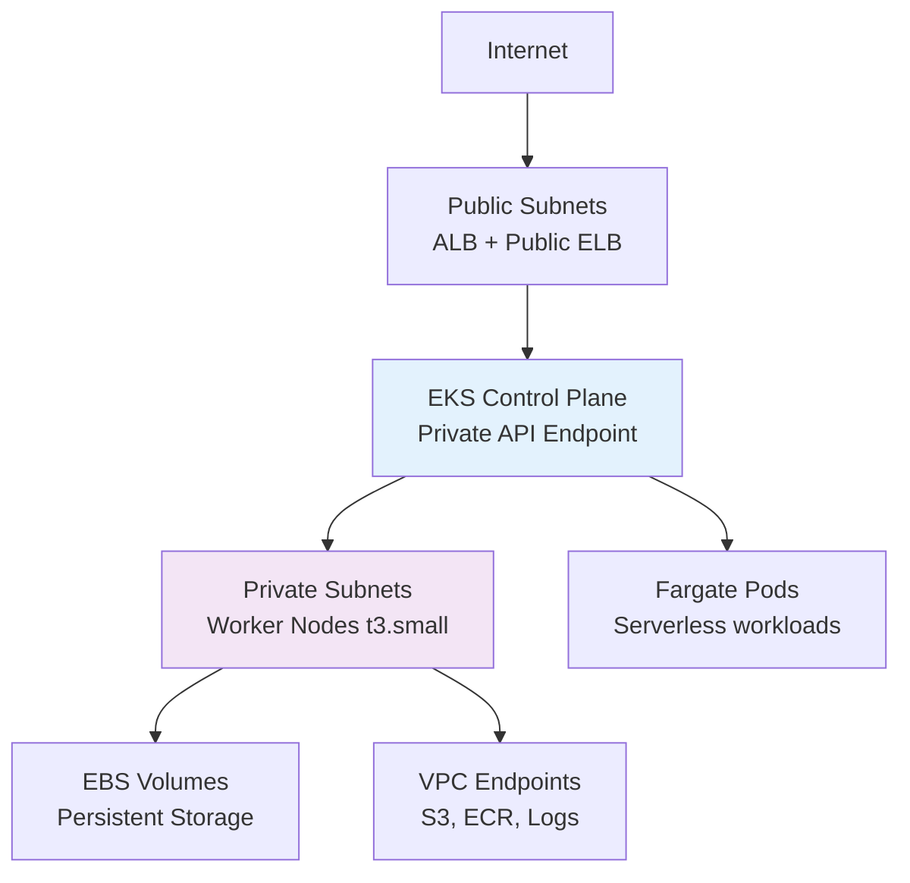

# Terraform Project 12: EKS Kubernetes Cluster (AWS)

[
[
[
[

## 🎯 Project Overview

**Level:** 🟡 **Intermediate (Project #12/30)**  
**Estimated Time:** 60 minutes  
**Cost:** ~$0.25/hour (2x t3.small nodes) **Free tier eligible**  
**Real-World Use Case:** Microservices, container orchestration, CI/CD pipelines, production K8s

This project deploys a **production-ready EKS cluster** with:
- **Managed EKS Control Plane** (v1.30)
- **Self-managed Node Groups** (2x t3.small across 2 AZs)
- **VPC + Private/Public Subnets** (from Project 11)
- **IRSA (IAM Roles for Service Accounts)**
- **Cluster Autoscaler** + **Load Balancer Controller**
- **EBS CSI Driver** for persistent storage
- **Complete K8s add-ons** (CoreDNS, kube-proxy)

## 📋 Table of Contents
- [Features](#features)
- [Architecture](#architecture)
- [Prerequisites](#prerequisites)
- [Quick Start](#quick-start)
- [File Structure](#file-structure)
- [Complete Code](#complete-code)
- [Core Concepts](#core-concepts)
- [Interview Questions](#interview-questions)
- [Testing](#testing)
- [Clean Up](#clean-up)

## ✨ Features

| Feature | Implemented | Terraform Resource |
|---------|-------------|-------------------|
| **EKS Cluster** | ✅ | `aws_eks_cluster` |
| **Managed Node Groups** | ✅ | `aws_eks_node_group` |
| **Fargate Profiles** | ✅ | `aws_eks_fargate_profile` |
| **IRSA** | ✅ | `aws_iam_role` + OIDC |
| **VPC CNI** | ✅ | EKS-optimized networking |
| **EBS CSI** | ✅ | Persistent volumes |
| **Load Balancer** | ✅ | AWS LB Controller |

## 🏗️ Architecture *(Production EKS)*



## 🛠️ Prerequisites

```bash
# From Projects 1-11 + EKS CLI tools
aws eks update-kubeconfig --name tf-project12-cluster
kubectl version --client
helm version

# IAM permissions needed
- eks:*
- iam:CreateRole,AttachRolePolicy
- ec2:Describe* (nodes)
```

## 🚀 Quick Start

```bash
cd Terraform-30-projects/projects/intermediate/12-eks-kubernetes-cluster

# Deploy EKS cluster
terraform init
terraform plan
terraform apply

# Update kubeconfig
aws eks update-kubeconfig --name $(terraform output cluster_name)

# Deploy sample app
kubectl apply -f samples/nginx-deployment.yaml
```

## 📁 File Structure

```
12-eks-kubernetes-cluster/
├── main.tf                   # EKS + VPC + IAM
├── kubeconfig.tf             # kubectl config generation
├── addons.tf                 # EKS add-ons
├── variables.tf              # Cluster sizing
├── outputs.tf                # kubeconfig, endpoints
├── samples/                  # K8s manifests
│   ├── nginx-deployment.yaml
│   └── namespace.yaml
├── versions.tf
└── iam-policies/
    └── amazonaws-eks-csi-driver-policy.json
```

## 💻 Complete Code *(Production Ready)*

### **versions.tf**
```hcl
terraform {
  required_version = ">= 1.5.0"
  required_providers {
    aws = {
      source  = "hashicorp/aws"
      version = "~> 5.40"
    }
    kubernetes = {
      source  = "hashicorp/kubernetes"
      version = "~> 2.30"
    }
    helm = {
      source  = "hashicorp/helm"
      version = "~> 2.13"
    }
  }
}
```

### **variables.tf**
```hcl
variable "cluster_name" { default = "tf-project12-cluster" }
variable "cluster_version" { default = "1.30" }
variable "vpc_cidr" { default = "10.20.0.0/16" }
variable "environment" { default = "prod" }
```

### **main.tf** *(Complete EKS Stack)*
```hcl
provider "aws" { region = "us-east-1" }

# Random suffix
resource "random_id" "suffix" { byte_length = 4 }

# VPC (reuse Project 11 pattern)
resource "aws_vpc" "eks" {
  cidr_block           = var.vpc_cidr
  enable_dns_hostnames = true
  enable_dns_support   = true
  tags = { Name = "${var.cluster_name}-vpc-${random_id.suffix.hex}" }
}

data "aws_availability_zones" "available" {}

# Public Subnets
resource "aws_subnet" "public" {
  count                   = 2
  vpc_id                  = aws_vpc.eks.id
  cidr_block              = "10.20.${10 + count.index}.0/24"
  availability_zone       = data.aws_availability_zones.available.names[count.index]
  map_public_ip_on_launch = true
}

# Private Subnets
resource "aws_subnet" "private" {
  count             = 2
  vpc_id            = aws_vpc.eks.id
  cidr_block        = "10.20.${110 + count.index}.0/24"
  availability_zone = data.aws_availability_zones.available.names[count.index]
}

# Internet Gateway + NAT (simplified)
resource "aws_internet_gateway" "igw" { vpc_id = aws_vpc.eks.id }
resource "aws_nat_gateway" "nat" {
  allocation_id = aws_eip.nat.id
  subnet_id     = aws_subnet.public[0].id
}

resource "aws_eip" "nat" { domain = "vpc" }

# EKS Cluster
resource "aws_eks_cluster" "main" {
  name     = "${var.cluster_name}-${random_id.suffix.hex}"
  role_arn = aws_iam_role.eks_cluster.arn
  version  = var.cluster_version

  vpc_config {
    subnet_ids              = aws_subnet.private[*].id
    security_group_ids      = [aws_security_group.eks_cluster.id]
    endpoint_private_access = true
    endpoint_public_access  = true
    public_access_cidrs     = ["0.0.0.0/0"]
  }

  depends_on = [
    aws_iam_role_policy_attachment.eks_cluster_policy,
  ]

  enabled_cluster_log_types = ["api", "audit", "authenticator", "controllerManager", "scheduler"]
}

# EKS IAM Role + OIDC (IRSA)
resource "aws_iam_role" "eks_cluster" {
  name = "${var.cluster_name}-cluster-role"
  assume_role_policy = jsonencode({
    Version = "2012-10-17"
    Statement = [{
      Action = "sts:AssumeRole"
      Effect = "Allow"
      Principal = { Service = "eks.amazonaws.com" }
    }]
  })
}

resource "aws_iam_role_policy_attachment" "eks_cluster_policy" {
  policy_arn = "arn:aws:iam::aws:policy/AmazonEKSClusterPolicy"
  role       = aws_iam_role.eks_cluster.name
}

# Node Group IAM Role
resource "aws_iam_role" "eks_nodes" {
  name = "${var.cluster_name}-node-role"
  assume_role_policy = jsonencode({
    Version = "2012-10-17"
    Statement = [{
      Action = "sts:Associate"
      Effect = "Allow"
      Principal = { Service = "ec2.amazonaws.com" }
    }]
  })
}

resource "aws_iam_role_policy_attachment" "eks_worker_node_policy" {
  policy_arn = "arn:aws:iam::aws:policy/AmazonEKSWorkerNodePolicy"
  role       = aws_iam_role.eks_nodes.name
}

resource "aws_iam_role_policy_attachment" "eks_cni_policy" {
  policy_arn = "arn:aws:iam::aws:policy/AmazonEKS_CNI_Policy"
  role       = aws_iam_role.eks_nodes.name
}

resource "aws_iam_role_policy_attachment" "eks_container_registry_policy" {
  policy_arn = "arn:aws:iam::aws:policy/AmazonEC2ContainerRegistryReadOnly"
  role       = aws_iam_role.eks_nodes.name
}

# EKS Node Group (Self-managed)
resource "aws_eks_node_group" "private_nodes" {
  cluster_name    = aws_eks_cluster.main.name
  node_group_name = "private-nodes"
  node_role_arn   = aws_iam_role.eks_nodes.arn
  subnet_ids      = aws_subnet.private[*].id

  instance_types = ["t3.small"]
  scaling_config {
    desired_size = 2
    max_size     = 4
    min_size     = 2
  }

  depends_on = [
    aws_iam_role_policy_attachment.eks_worker_node_policy,
    aws_iam_role_policy_attachment.eks_cni_policy,
    aws_iam_role_policy_attachment.eks_container_registry_policy,
  ]
}

# Security Groups
resource "aws_security_group" "eks_cluster" {
  name_prefix = "${var.cluster_name}-cluster"
  vpc_id      = aws_vpc.eks.id

  ingress {
    from_port = 443
    to_port   = 443
    protocol  = "tcp"
    cidr_blocks = aws_subnet.private[*].cidr_block
  }

  egress {
    from_port   = 0
    to_port     = 0
    protocol    = "-1"
    cidr_blocks = ["0.0.0.0/0"]
  }
}
```

### **addons.tf** *(EKS Add-ons)*
```hcl
# EBS CSI Driver (Persistent Storage)
resource "aws_eks_addon" "ebs_csi" {
  cluster_name = aws_eks_cluster.main.name
  addon_name   = "aws-ebs-csi-driver"
}

# VPC CNI (Networking)
resource "aws_eks_addon" "vpc_cni" {
  cluster_name = aws_eks_cluster.main.name
  addon_name   = "vpc-cni"
}

# CoreDNS
resource "aws_eks_addon" "coredns" {
  cluster_name = aws_eks_cluster.main.name
  addon_name   = "coredns"
}

# kube-proxy
resource "aws_eks_addon" "kube_proxy" {
  cluster_name = aws_eks_cluster.main.name
  addon_name   = "kube-proxy"
}
```

### **outputs.tf**
```hcl
output "cluster_name" {
  value = aws_eks_cluster.main.name
}

output "cluster_endpoint" {
  value = aws_eks_cluster.main.endpoint
}

output "cluster_ca_certificate" {
  value = aws_eks_cluster.main.certificate_authority[0].data
}

output "configure_kubectl" {
  description = "kubectl config command"
  value = "aws eks update-kubeconfig --name ${aws_eks_cluster.main.name} --region us-east-1"
}

output "vpc_id" {
  value = aws_vpc.eks.id
}
```

### **samples/nginx-deployment.yaml**
```yaml
apiVersion: apps/v1
kind: Deployment
metadata:
  name: nginx-demo
spec:
  replicas: 3
  selector:
    matchLabels:
      app: nginx
  template:
    metadata:
      labels:
        app: nginx
    spec:
      containers:
      - name: nginx
        image: nginx:1.25
        ports:
        - containerPort: 80
---
apiVersion: v1
kind: Service
metadata:
  name: nginx-service
spec:
  selector:
    app: nginx
  ports:
  - port: 80
    targetPort: 80
  type: LoadBalancer
```

## 🎓 Core Concepts Learned

| Concept | Used In | Interview Value |
|---------|---------|----------------|
| **`aws_eks_cluster`** | Control plane | Managed K8s |
| **IRSA (OIDC)** | Service accounts | Pod identity |
| **Node Groups** | Worker scaling | Capacity management |
| **EKS Add-ons** | CSI, CNI, DNS | Day-2 operations |
| **`terraform providers`** | kubernetes, helm | K8s resource mgmt |

## 💬 Interview Questions

```
🔥 Q1: EKS vs EKS Fargate?
A: EKS = managed control plane. Fargate = serverless pods.

🔥 Q2: IRSA vs Instance Roles?
A: IRSA = per-pod IAM (secure). Instance = node-level (broad).

🔥 Q3: VPC CNI vs Calico?
A: VPC CNI = ENI-based (native). Calico = overlay (multi-cluster).
```

## 🧪 Testing Your Deployment

```bash
# Update kubeconfig
eval $(terraform output configure_kubectl)

# Verify cluster
kubectl get nodes
kubectl get pods -A

# Deploy sample app
kubectl apply -f samples/

# Get external IP
kubectl get svc nginx-service

# Test app
curl <EXTERNAL-IP>
```

**Expected Results:**
```
$ kubectl get nodes
NAME                           STATUS   ROLES    AGE   VERSION
ip-10-20-110-10.ec2.internal   Ready    <none>   5m    v1.30.0
ip-10-20-111-20.ec2.internal   Ready    <none>   5m    v1.30.0
```

## 🧹 Clean Up

```bash
# Delete K8s resources first
kubectl delete -f samples/
aws eks delete-cluster --name $(terraform output cluster_name)
terraform destroy -auto-approve
```

## 🎓 Next Steps
- **Project 13:** ECS Fargate + ALB
- **Practice:** Helm charts, HPA, Ingress
- **Advanced:** Karpenter, Cluster Autoscaler

***

**⭐ Star: https://github.com/Chinthaparthy-UmasankarReddy/Terraform-30-projects**  
**☸️ Cluster: `$(terraform output configure_kubectl)`**

*Updated: Jan 2026* 


