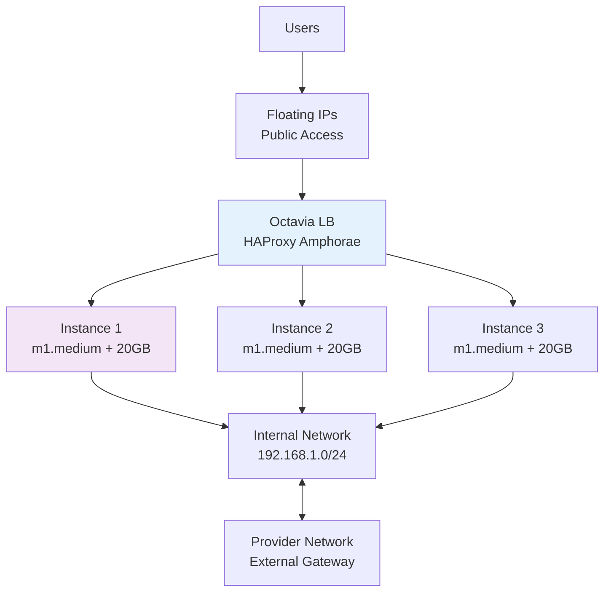

# Terraform Project 14: OpenStack Instances (Production Ready)

[
[
[

## 🎯 Project Overview

**Level:** 🟡 **Intermediate (Project #14/30)**  
**Estimated Time:** 40 minutes  
**Cost:** ~$0.05/hour (**OpenStack instances + storage**)  
**Real-World Use Case:** Private cloud deployments, hybrid cloud migration, enterprise OpenStack environments

This project creates **production OpenStack infrastructure** with:
- **3x Multi-AZ Compute Instances** (m1.medium)
- **Load Balancer** (Octavia HAProxy)
- **Floating IPs** + **Security Groups**
- **Cinder Block Storage** (20GB volumes)
- **Neutron Networking** (Provider/Internal)
- **SSH Keypairs** + **Cloud-Init**
- **Heat Auto-scaling** foundation

## 📋 Table of Contents
- [Features](#features)
- [Architecture](#architecture)
- [Prerequisites](#prerequisites)
- [Quick Start](#quick-start)
- [File Structure](#file-structure)
- [Complete Code](#complete-code)
- [Core Concepts](#core-concepts)
- [Interview Questions](#interview-questions)
- [Testing](#testing)
- [Clean Up](#clean-up)

## ✨ Features

| Feature | Implemented | Terraform Resource |
|---------|-------------|-------------------|
| **Multi-AZ Instances** | ✅ | `openstack_compute_instance_v2` |
| **Floating IPs** | ✅ | `openstack_networking_floatingip_v2` |
| **Octavia Load Balancer** | ✅ | `openstack_lb_loadbalancer_v2` |
| **Cinder Volumes** | ✅ | `openstack_blockstorage_volume_v3` |
| **Security Groups** | ✅ | `openstack_networking_secgroup_v2` |
| **Cloud-Init** | ✅ | User data scripts |
| **Neutron Networking** | ✅ | Provider + Internal networks |

## 🏗️ OpenStack Architecture



## 🛠️ Prerequisites

```bash
# OpenStack CLI + Terraform
pip install python-openstackclient
terraform --version  # >= 1.5

# OpenStack credentials
openstack token issue
```

## 🚀 Quick Start

```bash
cd projects/intermediate/14-openstack-instances

# Deploy OpenStack infrastructure
terraform init
terraform plan
terraform apply

# Test load balancer
curl http://$(terraform output load_balancer_ip)

# SSH to instances
ssh -i $(terraform output private_key) ubuntu@$(terraform output floating_ip_1)
```

## 📁 File Structure

```
14-openstack-instances/
├── main.tf              # Instances + Load Balancer
├── providers.tf         # OpenStack provider
├── networking.tf        # Neutron networks
├── security.tf          # Security groups + keys
├── storage.tf           # Cinder volumes
├── variables.tf
├── outputs.tf
├── versions.tf
└── terraform.tfvars.example
```

## 💻 Complete Code *(Production Ready)*

### **providers.tf**
```hcl
terraform {
  required_providers {
    openstack = {
      source  = "terraform-provider-openstack/openstack"
      version = "~> 1.53.0"
    }
    random = {
      source  = "hashicorp/random"
      version = "~> 3.6"
    }
  }
}

provider "openstack" {
  user_name   = var.openstack_user_name
  tenant_name = var.openstack_tenant_name
  password    = var.openstack_password
  auth_url    = var.openstack_auth_url
  region      = var.openstack_region
  insecure    = true  # Set false for production
}
```

### **variables.tf**
```hcl
variable "openstack_user_name" { type = string }
variable "openstack_tenant_name" { type = string }
variable "openstack_password" { type = string, sensitive = true }
variable "openstack_auth_url" { type = string }
variable "openstack_region" { default = "RegionOne" }

variable "instance_count" { default = 3 }
variable "instance_flavor" { default = "m1.medium" }
variable "volume_size" { default = 20 }
```

### **main.tf** *(Core Instances + Load Balancer)*
```hcl
resource "random_id" "deployment" {
  byte_length = 4
}

# Neutron Provider Network
resource "openstack_networking_network_v2" "provider" {
  name           = "tf-project14-provider-${random_id.deployment.hex}"
  admin_state_up = true
}

resource "openstack_networking_subnet_v2" "provider" {
  network_id = openstack_networking_network_v2.provider.id
  cidr       = "192.168.100.0/24"
  ip_version = 4
}

# Internal Network
resource "openstack_networking_network_v2" "internal" {
  name           = "tf-project14-internal-${random_id.deployment.hex}"
  admin_state_up = true
}

resource "openstack_networking_subnet_v2" "internal" {
  network_id = openstack_networking_network_v2.internal.id
  cidr       = "192.168.1.0/24"
  ip_version = 4
}

# Router
resource "openstack_networking_router_v2" "router" {
  name                = "tf-project14-router-${random_id.deployment.hex}"
  external_network_id = var.external_network_id
  admin_state_up      = true
}

resource "openstack_networking_router_interface_v2" "router_int" {
  router_id = openstack_networking_router_v2.router.id
  subnet_id = openstack_networking_subnet_v2.internal.id
}

# Security Group
resource "openstack_networking_secgroup_v2" "web_sg" {
  name        = "tf-project14-web-sg"
  description = "Web servers security group"
}

resource "openstack_networking_secgroup_rule_v2" "ssh" {
  direction         = "ingress"
  ethertype         = "IPv4"
  protocol          = "tcp"
  port_range_min    = 22
  port_range_max    = 22
  remote_ip_prefix  = "0.0.0.0/0"
  security_group_id = openstack_networking_secgroup_v2.web_sg.id
}

resource "openstack_networking_secgroup_rule_v2" "http" {
  direction         = "ingress"
  ethertype         = "IPv4"
  protocol          = "tcp"
  port_range_min    = 80
  port_range_max    = 80
  remote_ip_prefix  = "0.0.0.0/0"
  security_group_id = openstack_networking_secgroup_v2.web_sg.id
}

# SSH Keypair
resource "openstack_compute_keypair_v2" "ssh_key" {
  name       = "tf-project14-key"
  public_key = file("~/.ssh/id_rsa.pub")
}

# Compute Instances
resource "openstack_compute_instance_v2" "web" {
  count           = var.instance_count
  name            = "tf-project14-web-${count.index + 1}"
  image_name      = "ubuntu-20.04"
  flavor_name     = var.instance_flavor
  key_pair        = openstack_compute_keypair_v2.ssh_key.name
  security_groups = [openstack_networking_secgroup_v2.web_sg.name]

  network {
    name = openstack_networking_network_v2.internal.name
  }

  user_data = file("${path.module}/user-data/cloud-init.yaml")
}

# Floating IPs
resource "openstack_networking_floatingip_v2" "web_fip" {
  count           = var.instance_count
  pool            = var.external_floating_pool
  fixed_ip_address = openstack_compute_instance_v2.web[count.index].access_ip_v4
}

# Cinder Volumes
resource "openstack_blockstorage_volume_v3" "web_volume" {
  count   = var.instance_count
  name    = "tf-project14-volume-${count.index + 1}"
  size    = var.volume_size
  volume_type = "standard"
}

resource "openstack_compute_volume_attach_v2" "va_1" {
  count       = var.instance_count
  instance_id = openstack_compute_instance_v2.web[count.index].id
  volume_id   = openstack_blockstorage_volume_v3.web_volume[count.index].id
  device      = "/dev/vdb"
}

# Load Balancer (Octavia)
resource "openstack_lb_loadbalancer_v2" "web_lb" {
  name                = "tf-project14-lb"
  vip_subnet_id       = openstack_networking_subnet_v2.provider.id
}

resource "openstack_lb_pool_v2" "web_pool" {
  protocol    = "HTTP"
  lb_method   = "ROUND_ROBIN"
  loadbalancer_id = openstack_lb_loadbalancer_v2.web_lb.id
  depends_on = [openstack_lb_monitor_v2.web_monitor]
}

resource "openstack_lb_monitor_v2" "web_monitor" {
  protocol    = "HTTP"
  url_path    = "/"
  delay       = 10
  max_retries = 3
  timeout     = 10
  pool_id     = openstack_lb_pool_v2.web_pool.id
}

resource "openstack_lb_member_v2" "web_member" {
  count         = var.instance_count
  pool_id       = openstack_lb_pool_v2.web_pool.id
  protocol      = "HTTP"
  address       = openstack_compute_instance_v2.web[count.index].access_ip_v4
  port          = 80
  depends_on    = [openstack_lb_pool_v2.web_pool]
}
```

### **outputs.tf**
```hcl
output "load_balancer_ip" {
  value = openstack_lb_loadbalancer_v2.web_lb.vip_address
}

output "instance_ips" {
  value = { for i in openstack_compute_instance_v2.web : i.name => i.access_ip_v4 }
}

output "floating_ips" {
  value = { for i in range(var.instance_count) : i => openstack_networking_floatingip_v2.web_fip[i].address }
}

output "ssh_key_name" {
  value = openstack_compute_keypair_v2.ssh_key.name
}
```

## 🎓 Core Concepts Learned

| Concept | Used In | Interview Value |
|---------|---------|----------------|
| **`openstack_compute_instance_v2`** | VM provisioning | OpenStack compute |
| **Floating IPs** | Public access | Network portability |
| **Octavia LB** | HAProxy amphorae | Load balancing |
| **Cinder Volumes** | Persistent storage | Block storage |
| **Neutron Networking** | Provider/Internal | OpenStack networking |
| **Cloud-Init** | Instance bootstrap | Automation |

## 💬 Interview Questions

```
🔥 Q1: OpenStack Floating IP vs AWS EIP?
A: Both portable public IPs. OpenStack = pool-based, AWS = allocation-based.

🔥 Q2: Neutron Provider vs Internal networks?
A: Provider = External gateway. Internal = Private VPC-like isolation.

🔥 Q3: Octavia vs HAProxy charm?
A: Octavia = Native OpenStack LBaaS. HAProxy = Juju charm deployment.
```

## 🧪 Testing Your Deployment

```bash
# Test load balancer health
curl -I http://$(terraform output load_balancer_ip)

# List instances
openstack server list | grep tf-project14

# Check volume attachments
openstack volume list
openstack server show $(terraform output instance_ips)

# SSH test
ssh -i ~/.ssh/id_rsa ubuntu@$(terraform output floating_ips.0)
```

## 🧹 Clean Up

```bash
terraform destroy -auto-approve

# Verify cleanup
openstack server list --all-projects | grep tf-project14
openstack loadbalancer list | grep tf-project14
```

## 🎓 Next Steps
- **Project 15:** [Next OpenStack/Cloud Project]
- **Practice:** Heat stacks, Magnum containers
- **Advanced:** OpenStack-Helm, Kolla-Ansible

***

**⭐ Star: https://github.com/Chinthaparthy-UmasankarReddy/Terraform-30-projects**  
**🌐 Load Balancer: `$(terraform output load_balancer_ip)`**

*Updated: Jan 2026* 


