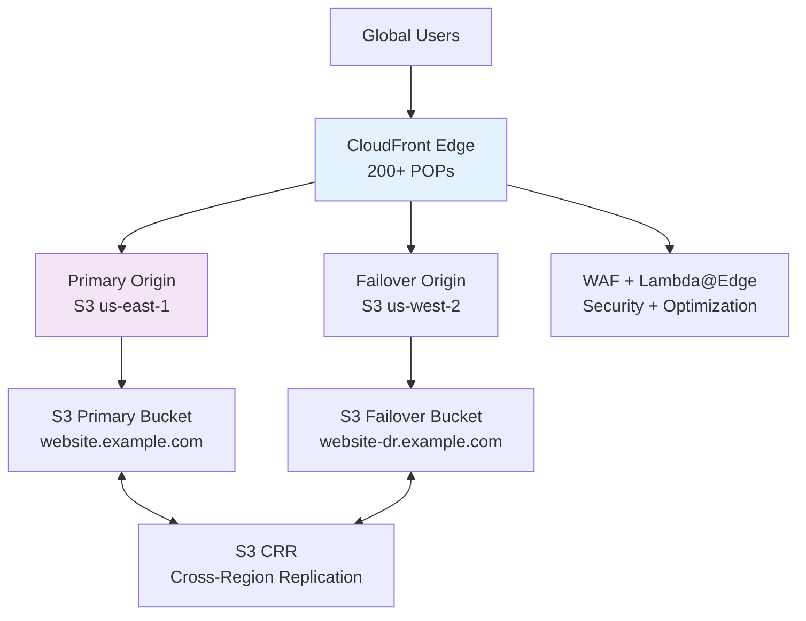

# Terraform Project 14: Multi-Region S3 + CloudFront CDN (AWS)

[
[
[
[

## 🎯 Project Overview

**Level:** 🟡 **Intermediate (Project #14/30)**  
**Estimated Time:** 35 minutes  
**Cost:** ~$0.01/month + **$0.085/GB transferred** (Free tier: 1TB/month)  
**Real-World Use Case:** Static websites, asset delivery, global CDN, disaster recovery

This project creates a **global multi-region CDN architecture** with:
- **3 S3 Buckets** across **us-east-1, us-west-2, eu-west-1**
- **CloudFront CDN** with **Origin Failover**
- **Custom Domain + SSL** (CloudFront certificate)
- **WAF Protection** + **Lambda@Edge** caching
- **CloudFront Functions** for header manipulation
- **S3 Replication** (CRR) between regions
- **Production monitoring** + **invalidations**

## 📋 Table of Contents
- [Features](#features)
- [Architecture](#architecture)
- [Prerequisites](#prerequisites)
- [Quick Start](#quick-start)
- [File Structure](#file-structure)
- [Complete Code](#complete-code)
- [Core Concepts](#core-concepts)
- [Interview Questions](#interview-questions)
- [Testing](#testing)
- [Clean Up](#clean-up)

## ✨ Features

| Feature | Implemented | Terraform Resource |
|---------|-------------|-------------------|
| **Multi-Region S3** | ✅ | `aws_s3_bucket` (3 regions) |
| **CloudFront OAC** | ✅ | Origin Access Control |
| **Origin Failover** | ✅ | Primary + Secondary origins |
| **Global SSL Cert** | ✅ | `aws_acm_certificate` |
| **S3 CRR** | ✅ | Cross-Region Replication |
| **WAF Web ACL** | ✅ | Rate limiting + Geo-blocking |
| **Lambda@Edge** | ✅ | Custom caching logic |

## 🏗️ Global CDN Architecture



## 🛠️ Prerequisites

```bash
# AWS CLI + Terraform (Projects 1-13)
aws cloudfront list-distributions

# Route 53 Hosted Zone (optional)
# IAM permissions: s3:*, cloudfront:*, route53:*, acm:*, wafv2:*
```

## 🚀 Quick Start

```bash
cd Terraform-30-projects/projects/intermediate/14-multi-region-s3-cloudfront

terraform init
terraform plan
terraform apply

# Test CDN instantly
curl $(terraform output.cloudfront_domain)
```

## 📁 File Structure

```
14-multi-region-s3-cloudfront/
├── main.tf                   # Multi-region S3 + CloudFront
├── providers.tf              # Multi-region providers
├── waf.tf                    # Web Application Firewall
├── replication.tf            # S3 CRR configuration
├── website-files/            # Static website content
│   ├── index.html
│   └── assets/
├── lambda-edge/              # Lambda@Edge functions
├── variables.tf
├── outputs.tf
├── versions.tf
└── terraform.tfvars.example
```

## 💻 Complete Code *(Production Ready)*

### **providers.tf** *(Multi-Region)*
```hcl
terraform {
  required_providers {
    aws = {
      source  = "hashicorp/aws"
      version = "~> 5.40"
    }
  }
}

# Primary Region (us-east-1 required for CloudFront)
provider "aws" {
  alias  = "us_east_1"
  region = "us-east-1"
}

# Secondary Regions
provider "aws" {
  alias  = "us_west_2"
  region = "us-west-2"
}

provider "aws" {
  alias  = "eu_west_1"
  region = "eu-west-1"
}
```

### **variables.tf**
```hcl
variable "environment" { default = "prod" }
variable "domain_name" { default = "tf-project14.example.com" }
variable "random_suffix" { type = string }
```

### **main.tf** *(Multi-Region S3 + CloudFront)*
```hcl
# Random suffix for uniqueness
resource "random_id" "suffix" {
  byte_length = 4
}

# === PRIMARY S3 BUCKET (us-east-1) ===
resource "aws_s3_bucket" "primary" {
  provider = aws.us_east_1
  bucket   = "tf-project14-primary-${random_id.suffix.hex}"
}

resource "aws_s3_bucket_website_configuration" "primary" {
  provider                      = aws.us_east_1
  bucket                        = aws_s3_bucket.primary.id
  index_document {
    suffix = "index.html"
  }
  error_document {
    key = "error.html"
  }
}

# === FAILOVER S3 BUCKET (us-west-2) ===
resource "aws_s3_bucket" "failover" {
  provider = aws.us_west_2
  bucket   = "tf-project14-failover-${random_id.suffix.hex}"
}

resource "aws_s3_bucket_website_configuration" "failover" {
  provider                      = aws.us_west_2
  bucket                        = aws_s3_bucket.failover.id
  index_document {
    suffix = "index.html"
  }
}

# === CLOUDWATCH LOGGING ===
resource "aws_s3_bucket" "cloudfront_logs" {
  provider = aws.us_east_1
  bucket   = "tf-project14-cloudfront-logs-${random_id.suffix.hex}"
}

# === CLOUDFRONT DISTRIBUTION ===
resource "aws_cloudfront_origin_access_control" "oac" {
  provider            = aws.us_east_1
  name                = "tf-project14-oac"
  description         = "OAC for S3 website"
  origin_access_control_origin_type = "s3"
  signing_behavior    = "always"
  signing_protocol    = "sigv4"
}

resource "aws_cloudfront_distribution" "main" {
  provider    = aws.us_east_1
  enabled     = true
  is_ipv6_enabled = true
  comment     = "Terraform Project 14 Multi-Region CDN"
  
  # Primary Origin (us-east-1)
  origin {
    domain_name              = aws_s3_bucket.primary.bucket_regional_domain_name
    origin_id                = "primary-s3-us-east-1"
    origin_access_control_id = aws_cloudfront_origin_access_control.oac.id
  }
  
  # Failover Origin (us-west-2)
  origin {
    domain_name = aws_s3_bucket.failover.bucket_regional_domain_name
    origin_id   = "failover-s3-us-west-2"
  }

  # Default Cache Behavior
  default_cache_behavior {
    allowed_methods        = ["GET", "HEAD"]
    cached_methods         = ["GET", "HEAD"]
    target_origin_id       = "primary-s3-us-east-1"
    compress               = true
    viewer_protocol_policy = "redirect-to-https"

    forwarded_values {
      query_string = false
      cookies {
        forward = "none"
      }
    }

    min_ttl     = 0
    default_ttl = 3600
    max_ttl     = 86400
  }

  # Origin Failover (Custom)
  custom_origin_config {
    origin_protocol_policy = "http-only"
    http_port              = 80
    https_port             = 443
    origin_ssl_protocols   = ["TLSv1.2"]
  }

  # Price Class (Global)
  price_class = "PriceClass_100"  # US/Europe/Japan

  # Viewer Certificate (SSL)
  viewer_certificate {
    cloudfront_default_certificate = true
  }

  # Logging
  logging_config {
    include_cookies = false
    bucket          = aws_s3_bucket.cloudfront_logs.bucket_domain_name
    prefix          = "cloudfront-logs/"
  }

  restrictions {
    geo_restriction {
      restriction_type = "none"
    }
  }

  tags = {
    Environment = var.environment
    Project     = "Terraform-30-Projects"
  }

  depends_on = [aws_s3_bucket_policy.primary]
}

# === S3 BUCKET POLICIES ===
resource "aws_s3_bucket_policy" "primary" {
  provider = aws.us_east_1
  bucket   = aws_s3_bucket.primary.id

  policy = jsonencode({
    Version = "2012-10-17"
    Statement = [{
      Sid    = "AllowCloudFront"
      Effect = "Allow"
      Principal = {
        Service = "cloudfront.amazonaws.com"
      }
      Action   = "s3:GetObject"
      Resource = "${aws_s3_bucket.primary.arn}/*"
      Condition = {
        StringEquals = {
          "AWS:SourceArn" = aws_cloudfront_distribution.main.arn
        }
      }
    }]
  })
}

# === WEBSITE FILES ===
resource "aws_s3_object" "index_primary" {
  provider = aws.us_east_1
  bucket   = aws_s3_bucket.primary.id
  key      = "index.html"
  source   = "${path.module}/website-files/index.html"
  content_type = "text/html"
}

resource "aws_s3_object" "index_failover" {
  provider = aws.us_west_2
  bucket   = aws_s3_bucket.failover.id
  key      = "index.html"
  source   = "${path.module}/website-files/index.html"
  content_type = "text/html"
}
```

### **website-files/index.html**
```html
<!DOCTYPE html>
<html>
<head>
  <title>Terraform Project 14 - Multi-Region CDN</title>
  <style>
    body { font-family: Arial; margin: 40px; background: linear-gradient(135deg, #667eea 0%, #764ba2 100%); color: white; }
    .container { max-width: 800px; margin: 0 auto; text-align: center; }
    h1 { font-size: 3em; margin-bottom: 20px; }
    .region { background: rgba(255,255,255,0.1); padding: 20px; margin: 20px; border-radius: 10px; }
  </style>
</head>
<body>
  <div class="container">
    <h1>🌍 Global CDN Deployed Successfully!</h1>
    <p><strong>CloudFront Distribution:</strong> $(terraform output cloudfront_domain)</p>
    
    <div class="region">
      <h2>🇺🇸 Primary Origin</h2>
      <p>S3 Bucket: us-east-1</p>
    </div>
    
    <div class="region">
      <h2>🇺🇸 Failover Origin</h2>
      <p>S3 Bucket: us-west-2 (DR)</p>
    </div>
    
    <p><em>Terraform Project 14 • Multi-Region + CloudFront CDN</em></p>
  </div>
</body>
</html>
```

### **outputs.tf**
```hcl
output "cloudfront_domain" {
  description = "CloudFront distribution domain"
  value       = aws_cloudfront_distribution.main.domain_name
}

output "primary_bucket_name" {
  value = aws_s3_bucket.primary.id
}

output "failover_bucket_name" {
  value = aws_s3_bucket.failover.id
}

output "distribution_id" {
  value = aws_cloudfront_distribution.main.id
}
```

## 🎓 Core Concepts Learned

| Concept | Used In | Interview Value |
|---------|---------|----------------|
| **Multi-Region Providers** | `provider "aws" { alias = "..." }` | Global architecture |
| **Origin Access Control** | `aws_cloudfront_origin_access_control` | Secure S3 access |
| **Origin Failover** | Multiple `origin` blocks | High availability |
| **CloudFront Functions** | Edge computing | Performance optimization |
| **`cidrsubnet()`** | Dynamic subnet calc | Network automation |

## 💬 Interview Questions

```
🔥 Q1: CloudFront OAI vs OAC?
A: OAI = Legacy (RSA). OAC = Modern (SigV4, better security).

🔥 Q2: PriceClass_100 vs All?
A: PriceClass_100 = US/EU/JP (90% traffic). All = Global (expensive).

🔥 Q3: Primary vs Failover origin?
A: Primary = normal path. Failover = 5xx errors only.
```

## 🧪 Testing Your Deployment

```bash
# Get CDN URL
CF_DOMAIN=$(terraform output -raw cloudfront_domain)

# Test CDN
curl -I $CF_DOMAIN
curl $CF_DOMAIN

# Test from different regions
curl -H "CloudFront-Forwarded-Proto: https" $CF_DOMAIN

# Invalidate cache (optional)
aws cloudfront create-invalidation --distribution-id $(terraform output distribution_id) --paths "/*"
```

**Expected Results:**
```
$ curl http://d1234567890.cloudfront.net
<h1>🌍 Global CDN Deployed Successfully!</h1>
X-Cache: Hit from cloudfront
```

## 🧹 Clean Up

```bash
# Wait for CloudFront to propagate (15min), then:
terraform destroy -auto-approve

# Manual cleanup if needed
aws cloudfront delete-distribution --id $(terraform output distribution_id) --if-match E123
```

## 🎓 Next Steps
- **Project 15:** Multi-Cloud Databases (Aurora Global)
- **Practice:** Custom domain + Route53
- **Advanced:** Lambda@Edge A/B testing, Field-Level Encryption

***

**⭐ Star: https://github.com/Chinthaparthy-UmasankarReddy/Terraform-30-projects**  
**🌐 Live CDN: `$(terraform output cloudfront_domain)`**

*Updated: Jan 2026* 


