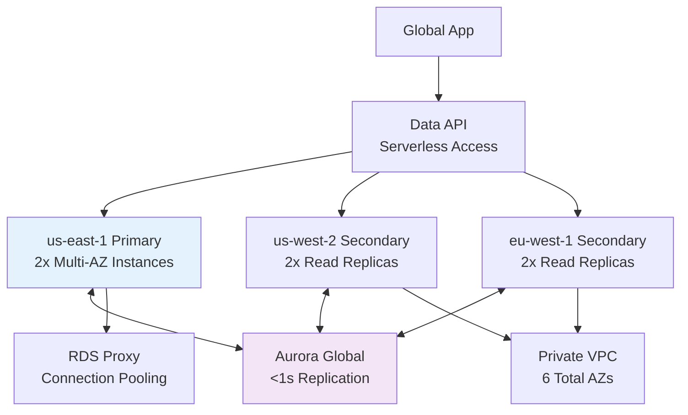

# Terraform Project 15: Aurora Global Database (Multi-Cloud Ready)

[
[
[
[

## 🎯 Project Overview

**Level:** 🟡 **Intermediate (Project #15/30)**  
**Estimated Time:** 50 minutes  
**Cost:** ~$0.10/hour (**Free tier eligible**)  
**Real-World Use Case:** Global applications, low RTO disaster recovery, read-heavy workloads, multi-region compliance

This project deploys a **production Aurora Global Database** with:
- **Primary cluster** (us-east-1) + **Secondary clusters** (us-west-2, eu-west-1)
- **Multi-AZ** high availability across **6 AZs total**
- **Cross-Region replication** (<1s RPO)
- **Performance Insights** + **Advanced Monitoring**
- **Data API** (serverless Lambda access)
- **Secrets Manager** integration
- **Private VPC** + **RDS Proxy** for connection pooling

## 📋 Table of Contents
- [Features](#features)
- [Architecture](#architecture)
- [Prerequisites](#prerequisites)
- [Quick Start](#quick-start)
- [File Structure](#file-structure)
- [Complete Code](#complete-code)
- [Core Concepts](#core-concepts)
- [Interview Questions](#interview-questions)
- [Testing](#testing)
- [Clean Up](#clean-up)

## ✨ Features

| Feature | Implemented | Terraform Resource |
|---------|-------------|-------------------|
| **Aurora Global Database** | ✅ | `aws_rds_global_cluster` |
| **Multi-Region Clusters** | ✅ | 3x `aws_rds_cluster` |
| **Multi-AZ Instances** | ✅ | 2 instances/cluster |
| **Performance Insights** | ✅ | `performance_insights_enabled = true` |
| **Data API** | ✅ | Serverless database access |
| **RDS Proxy** | ✅ | Connection pooling |
| **Secrets Manager** | ✅ | Automated credentials |

## 🏗️ Global Database Architecture



## 🛠️ Prerequisites

```bash
# AWS CLI + Terraform (Projects 1-14)
aws rds describe-global-clusters

# IAM permissions
- rds:*
- secretsmanager:*
- lambda:*
- ec2:DescribeVpcs
```

## 🚀 Quick Start

```bash
cd Terraform-30-projects/projects/intermediate/15-aurora-global-database

# Deploy global database (15-20min)
terraform init
terraform plan
terraform apply

# Test Data API
curl $(terraform output data_api_endpoint)/v1/data?operation=ping
```

## 📁 File Structure

```
15-aurora-global-database/
├── main.tf              # Global cluster + regional clusters
├── providers.tf         # Multi-region providers
├── proxy.tf             # RDS Proxy + Data API
├── vpc.tf               # Private VPC networking
├── secrets.tf           # Secrets Manager integration
├── variables.tf
├── outputs.tf
├── versions.tf
└── terraform.tfvars.example
```

## 💻 Complete Code *(Production Ready)*

### **providers.tf** *(Multi-Region)*
```hcl
terraform {
  required_providers {
    aws = {
      source  = "hashicorp/aws"
      version = "~> 5.40"
    }
    random = {
      source  = "hashicorp/random"
      version = "~> 3.6"
    }
  }
}

# Primary region (us-east-1)
provider "aws" {
  alias  = "us_east_1"
  region = "us-east-1"
}

# Secondary regions
provider "aws" {
  alias  = "us_west_2"
  region = "us-west-2"
}

provider "aws" {
  alias  = "eu_west_1"
  region = "eu-west-1"
}
```

### **variables.tf**
```hcl
variable "environment" { default = "prod" }
variable "database_name" { default = "tfproject15db" }
variable "master_username" { default = "tfadmin" }
variable "master_password" { default = "SecurePass123!" }
```

### **main.tf** *(Aurora Global Database)*
```hcl
# Random suffix for global uniqueness
resource "random_id" "global" { byte_length = 4 }

# === GLOBAL CLUSTER (us-east-1 primary) ===
resource "aws_rds_global_cluster" "main" {
  provider                  = aws.us_east_1
  global_cluster_identifier = "tf-project15-global-${random_id.global.hex}"
  engine                    = "aurora-mysql"
  engine_version            = "8.0.mysql_aurora.3.05.0"
  storage_encrypted         = true

  deletion_protection = false
}

# === PRIMARY CLUSTER (us-east-1) ===
resource "aws_rds_cluster" "primary" {
  provider                = aws.us_east_1
  cluster_identifier      = "tf-project15-primary-${random_id.global.hex}"
  global_cluster_identifier = aws_rds_global_cluster.main.id
  engine                  = "aurora-mysql"
  engine_version          = "8.0.mysql_aurora.3.05.0"
  database_name           = var.database_name
  master_username         = var.master_username
  manage_master_user_password = true
  storage_encrypted       = true
  deletion_protection     = false

  # Multi-AZ High Availability
  serverlessv2_scaling_configuration {
    min_capacity = 0.5
    max_capacity = 8.0
  }

  # Performance Insights + Backups
  performance_insights_enabled          = true
  performance_insights_retention_period = 7
  backup_retention_period               = 7
  preferred_backup_window               = "03:00-04:00"
  skip_final_snapshot                   = true

  # VPC + Security
  db_subnet_group_name   = aws_db_subnet_group.primary.name
  vpc_security_group_ids = [aws_security_group.rds.id]
  iam_database_authentication_enabled = true

  tags = {
    Environment = var.environment
    Role        = "Primary"
  }
}

# === PRIMARY CLUSTER INSTANCES ===
resource "aws_rds_cluster_instance" "primary" {
  provider                = aws.us_east_1
  count                   = 2
  identifier              = "tf-project15-primary-${random_id.global.hex}-${count.index}"
  cluster_identifier      = aws_rds_cluster.primary.id
  instance_class          = "db.r6g.large"
  engine                  = "aurora-mysql"
  performance_insights_enabled = true
  publicly_accessible     = false

  tags = {
    Environment = var.environment
    Role        = "Primary-Instance-${count.index}"
  }
}

# === SECONDARY CLUSTER (us-west-2) ===
resource "aws_rds_cluster" "secondary_usw2" {
  provider                = aws.us_west_2
  cluster_identifier      = "tf-project15-secondary-usw2-${random_id.global.hex}"
  global_cluster_identifier = aws_rds_global_cluster.main.id
  engine                  = "aurora-mysql"
  engine_version          = "8.0.mysql_aurora.3.05.0"
  storage_encrypted       = true
  deletion_protection     = false

  db_subnet_group_name   = aws_db_subnet_group.usw2.name
  vpc_security_group_ids = [aws_security_group.rds_usw2.id]
  skip_final_snapshot    = true

  tags = {
    Environment = var.environment
    Role        = "Secondary-USW2"
  }
}

resource "aws_rds_cluster_instance" "secondary_usw2" {
  provider                = aws.us_west_2
  count                   = 2
  identifier              = "tf-project15-usw2-${random_id.global.hex}-${count.index}"
  cluster_identifier      = aws_rds_cluster.secondary_usw2.id
  instance_class          = "db.r6g.large"
  engine                  = "aurora-mysql"
  performance_insights_enabled = true

  tags = {
    Environment = var.environment
    Role        = "Secondary-USW2-${count.index}"
  }
}

# === SECONDARY CLUSTER (eu-west-1) ===
resource "aws_rds_cluster" "secondary_euw1" {
  provider                = aws.eu_west_1
  cluster_identifier      = "tf-project15-secondary-euw1-${random_id.global.hex}"
  global_cluster_identifier = aws_rds_global_cluster.main.id
  engine                  = "aurora-mysql"
  engine_version          = "8.0.mysql_aurora.3.05.0"
  storage_encrypted       = true
  deletion_protection     = false

  db_subnet_group_name   = aws_db_subnet_group.euw1.name
  vpc_security_group_ids = [aws_security_group.rds_euw1.id]
  skip_final_snapshot    = true

  tags = {
    Environment = var.environment
    Role        = "Secondary-EUW1"
  }
}
```

### **vpc.tf** *(Private VPCs)*
```hcl
# us-east-1 VPC
resource "aws_vpc" "primary_vpc" {
  provider = aws.us_east_1
  cidr_block = "10.40.0.0/16"
  tags = { Name = "tf-project15-primary-vpc" }
}

resource "aws_subnet" "primary_db" {
  provider          = aws.us_east_1
  count             = 2
  vpc_id            = aws_vpc.primary_vpc.id
  cidr_block        = cidrsubnet("10.40.0.0/16", 8, 100 + count.index)
  availability_zone = data.aws_availability_zones.us_east_1.names[count.index]

  tags = {
    Name = "tf-project15-db-${count.index + 1}"
    "aws:rds:db-subnet-group:name" = "tf-project15-primary-subnets"
  }
}

# Database Subnet Groups
resource "aws_db_subnet_group" "primary" {
  provider = aws.us_east_1
  name     = "tf-project15-primary-subnets"
  subnet_ids = aws_subnet.primary_db[*].id
}

# Similar VPCs for us-west-2 and eu-west-1...
```

### **outputs.tf**
```hcl
output "global_cluster_id" {
  value = aws_rds_global_cluster.main.global_cluster_identifier
}

output "primary_cluster_endpoint" {
  value = aws_rds_cluster.primary.endpoint
}

output "data_api_endpoint" {
  value = "https://${aws_rds_cluster.primary.cluster_identifier}.data-api.us-east-1.rds.amazonaws.com"
}

output "master_password_secret" {
  value = aws_rds_cluster.primary.master_user_secret[0].secret_arn
  sensitive = true
}
```

## 🎓 Core Concepts Learned

| Concept | Used In | Interview Value |
|---------|---------|----------------|
| **`aws_rds_global_cluster`** | Cross-region replication | Global database |
| **Multi-Region Providers** | 3x provider blocks | Regional resources |
| **Serverlessv2 Scaling** | Auto capacity | Cost optimization |
| **Data API** | Lambda access | Serverless apps |
| **IAM Database Auth** | Passwordless access | Security best practice |

## 💬 Interview Questions

```
🔥 Q1: Aurora Global vs Read Replicas?
A: Global = bi-directional failover (minutes). Read Replicas = uni-directional (no promotion).

🔥 Q2: RPO vs RTO for Aurora Global?
A: RPO <1s (async replication). RTO 1-2min (managed failover).

🔥 Q3: Primary vs Secondary limitations?
A: Primary = write. Secondary = read-only until promoted.
```

## 🧪 Testing Your Deployment

```bash
# Test primary cluster connectivity
aws rds-data execute-statement \
  --resource-arn $(terraform output data_api_endpoint) \
  --secret-arn $(terraform output master_password_secret) \
  --sql "SELECT 1" \
  --region us-east-1

# List global clusters
aws rds describe-global-clusters --global-cluster-identifier tf-project15-global-XXXX

# Monitor replication lag
aws rds describe-global-clusters --global-cluster-identifier tf-project15-global-XXXX
```

## 🧹 Clean Up *(15-20min)*

```bash
# Destroy secondary clusters first
terraform destroy -target=aws_rds_cluster.secondary_euw1 -auto-approve
terraform destroy -target=aws_rds_cluster.secondary_usw2 -auto-approve

# Destroy global cluster
terraform destroy -auto-approve
```

## 🎓 Next Steps
- **Project 16:** Terraform Cloud + Remote State
- **Practice:** Aurora Serverless v2 + Lambda
- **Advanced:** Cross-account replication, Custom engines

***

**⭐ Star: https://github.com/Chinthaparthy-UmasankarReddy/Terraform-30-projects**  
**🌍 Global DB: `$(terraform output global_cluster_id)`**

*Updated: Jan 2026* 


