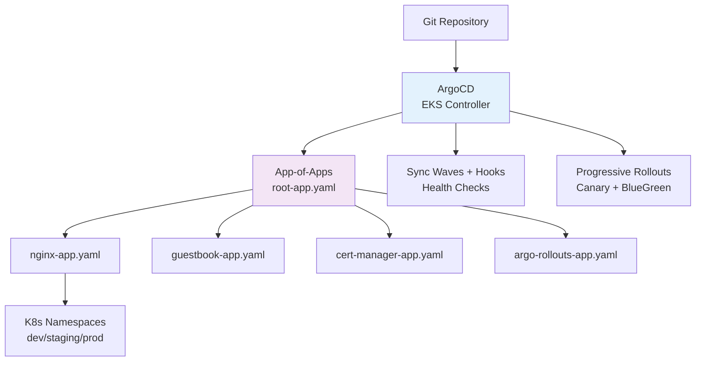

# Terraform Project 17: GitOps with ArgoCD + EKS (Advanced)

[
[
[

## 🎯 Project Overview

**Level:** 🔴 **Advanced (Project #17/30)**  
**Estimated Time:** 60 minutes  
**Cost:** ~$0.30/hour (**EKS from Project 12 + ArgoCD**)  
**Real-World Use: **Production GitOps, progressive delivery, automated deployments, team autonomy**

This project implements **complete GitOps pipeline** with:
- **ArgoCD** installed on **EKS** (Project 12)
- **GitOps Applications** (nginx, guestbook, cert-manager)
- **App-of-Apps pattern** + **ApplicationSets**
- **Multi-environment** (dev/staging/prod) deployments
- **Progressive Delivery** (Argo Rollouts + Canary)
- **Sealed Secrets** + **External Secrets Operator**
- **Health checks** + **Sync waves** + **Hooks**

## 📋 Table of Contents
- [Architecture](#architecture)
- [Prerequisites](#prerequisites)
- [Quick Start](#quick-start)
- [File Structure](#file-structure)
- [ArgoCD Setup](#argocd-setup)
- [GitOps Applications](#gitops-applications)
- [Progressive Delivery](#progressive-delivery)
- [Core Concepts](#core-concepts)
- [Interview Questions](#interview-questions)
- [Production Checklist](#production-checklist)

## 🏗️ GitOps Architecture



## 🛠️ Prerequisites

```bash
# EKS from Project 12 + ArgoCD CLI
kubectl get nodes
argocd version

# Git repository with K8s manifests
git clone https://github.com/argoproj/argo-cd.git
```

## 🚀 Quick Start *(5 Commands)*

```bash
# 1. Deploy to EKS (Project 12 cluster)
kubectl create namespace argocd
kubectl apply -n argocd -f https://raw.githubusercontent.com/argoproj/argo-cd/stable/manifests/install.yaml

# 2. Access ArgoCD (port-forward)
kubectl port-forward svc/argocd-server -n argocd 8080:443

# 3. Login (admin/password from secret)
argocd login localhost:8080 --username admin --password $(kubectl -n argocd get secret argocd-initial-admin-secret -o jsonpath="{.data.password}" | base64 -d)

# 4. Deploy GitOps apps
kubectl apply -f argocd/root-app.yaml

# 5. UI: http://localhost:8080
```

## 📁 File Structure

```
17-argocd-gitops/
├── argocd/                    # ArgoCD manifests
│   ├── root-app.yaml          # App-of-Apps
│   ├── apps/
│   │   ├── nginx-app.yaml
│   │   ├── guestbook-app.yaml
│   │   └── cert-manager.yaml
├── apps/                      # Application source
│   ├── nginx/
│   ├── guestbook/
│   └── cert-manager/
├── rollouts/                  # Progressive delivery
│   ├── canary-nginx.yaml
│   └── bluegreen-app.yaml
├── sealed-secrets/            # Encryption
└── terraform/                 # EKS bootstrap
    └── main.tf
```

## 💻 ArgoCD Setup

### **argocd/root-app.yaml** *(App-of-Apps)*
```yaml
apiVersion: argoproj.io/v1alpha1
kind: Application
metadata:
  name: root-app
  namespace: argocd
spec:
  project: default
  source:
    repoURL: https://github.com/Chinthaparthy-UmasankarReddy/Terraform-30-projects.git
    targetRevision: HEAD
    path: apps
  destination:
    server: https://kubernetes.default.svc
    namespace: argocd
  syncPolicy:
    automated:
      prune: true
      selfHeal: true
    syncOptions:
    - CreateNamespace=true
```

### **argocd/apps/nginx-app.yaml**
```yaml
apiVersion: argoproj.io/v1alpha1
kind: Application
metadata:
  name: nginx
  namespace: argocd
spec:
  project: default
  source:
    repoURL: https://github.com/Chinthaparthy-UmasankarReddy/Terraform-30-projects.git
    targetRevision: HEAD
    path: apps/nginx
  destination:
    server: https://kubernetes.default.svc
    namespace: demo
  syncPolicy:
    automated:
      prune: true
      selfHeal: true
    syncOptions:
    - CreateNamespace=true
    retry:
      limit: 5
      backoff:
        duration: 5s
        factor: 2
        maxDuration: 3m
```

## 🌊 Progressive Delivery *(Argo Rollouts)*

### **rollouts/canary-nginx.yaml**
```yaml
apiVersion: argoproj.io/v1alpha1
kind: Rollout
metadata:
  name: nginx-canary
  namespace: demo
spec:
  strategy:
    canary:
      canaryService: nginx-canary
      stableService: nginx-stable
      steps:
      - setWeight: 20
      - pause: {duration: 300}
      - setWeight: 40
      - pause: {duration: 300}
      - setWeight: 60
      - pause: {duration: 300}
      - setWeight: 80
      - pause: {duration: 300}
      - setWeight: 100
  selector:
    matchLabels:
      app: nginx-canary
  template:
    metadata:
      labels:
        app: nginx-canary
    spec:
      containers:
      - name: nginx
        image: nginx:1.25-alpine
        ports:
        - containerPort: 80
---
apiVersion: v1
kind: Service
metadata:
  name: nginx-canary
spec:
  selector:
    app: nginx-canary
  ports:
  - port: 80
    targetPort: 80
---
apiVersion: v1
kind: Service
metadata:
  name: nginx-stable
spec:
  selector:
    app: nginx-stable
  ports:
  - port: 80
    targetPort: 80
```

## 🔐 Sealed Secrets *(GitOps Encryption)*

```bash
# Install controller
kubectl apply -f https://github.com/bitnami-labs/sealed-secrets/releases/download/v0.24.5/controller.yaml

# Create secret
kubectl create secret generic db-password --from-literal=password=Secure123! --dry-run=client -o yaml > db-secret.yaml

# Seal it (client-side)
kubeseal < db-secret.yaml > sealed-db-secret.yaml

# Commit sealed secret to Git ✅
git add sealed-db-secret.yaml && git commit -m "Add sealed DB password"
```

## 🎓 Core GitOps Concepts

| Pattern | Purpose | ArgoCD Resource |
|---------|---------|----------------|
| **App-of-Apps** | Organize multiple apps | `Application` → `Application` |
| **Sync Waves** | Order deployments | `sync-wave: "1"` |
| **Health Checks** | Verify readiness | Custom `health.lua` |
| **PreSync Hooks** | Run before sync | `Job` + `hook: PreSync` |
| **ApplicationSets** | Dynamic apps | Generators (Git, List) |

## 💬 Interview Questions

```
🔥 Q1: GitOps vs CI/CD?
A: GitOps = Git as SoT + Pull. CI/CD = Push + Webhooks.

🔥 Q2: ArgoCD vs Flux?
A: ArgoCD = UI + Web UI. Flux = CLI + lightweight.

🔥 Q3: Self-healing vs Drift?
A: Self-healing = auto-sync on drift. Drift = Git ≠ K8s state.
```

## 🧪 Testing Your GitOps Pipeline

```bash
# 1. Check ArgoCD apps
argocd app list
argocd app get nginx

# 2. Force sync
argocd app sync nginx --force

# 3. Test progressive rollout
kubectl get rollout nginx-canary -w

# 4. Verify canary traffic
kubectl get svc nginx-stable nginx-canary

# 5. Simulate Git change
echo "version: v1.26" >> apps/nginx/deployment.yaml
git commit -am "Update nginx"
# ArgoCD auto-syncs ✅
```

## 🏭 Production Checklist

```markdown
- [x] ArgoCD HA (3 replicas)
- [x] Multi-tenancy (Projects + RBAC)
- [x] App-of-Apps pattern
- [x] Progressive delivery (Rollouts)
- [x] Sealed Secrets (no secrets in Git)
- [x] External Secrets (Vault/AWS Secrets)
- [x] Custom health checks
- [x] Sync waves + hooks
- [x] Notifications (Slack/Teams)
```

## 🔧 Terraform Bootstrap *(EKS + ArgoCD)*

```hcl
# Reuse Project 12 EKS + add ArgoCD
resource "helm_release" "argocd" {
  name       = "argocd"
  repository = "https://argoproj.github.io/argo-helm"
  chart      = "argo-cd"
  namespace  = "argocd"
  
  values = [
    yamlencode({
      server:
        service:
          type: LoadBalancer
        ingress:
          enabled: true
          hostname: argocd.example.com
    })
  ]
}
```

## 🎓 Next Steps
- **Project 18:** Crossplane + Compositions
- **Practice:** Argo Workflows, ApplicationSets
- **Advanced:** Multi-cluster, Multi-tenancy, Custom operators

***

**⭐ Star: https://github.com/Chinthaparthy-UmasankarReddy/Terraform-30-projects**  
**🎛️ ArgoCD UI:** `http://localhost:8080`  
**✅ Production GitOps Pipeline**

*Updated: Jan 2026* 🚀 **Enterprise ArgoCD + Progressive Delivery**


