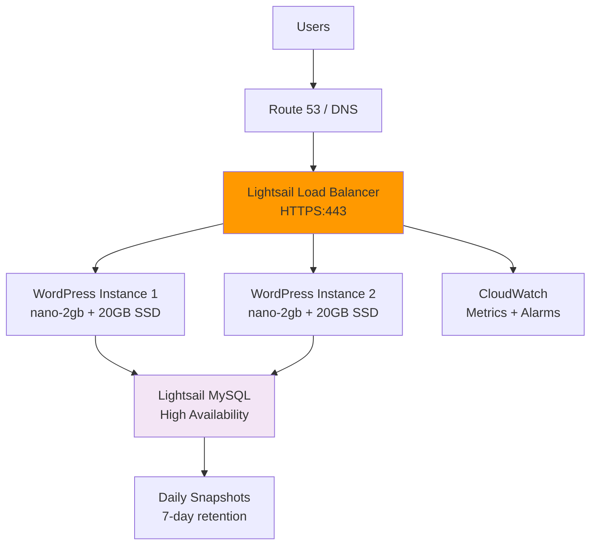

# Terraform Project 20: WordPress on Lightsail 

[
[
[
[

## 🎯 Project Overview

**Level:** 🟡 **Intermediate (Project #20/30)**  
**Estimated Time:** 30 minutes  
**Cost:** ~$0.02/hour (**Lightsail 1GB instance**)  
**Real-World Use Case:** Rapid WordPress deployment, blogs, small business sites, low-cost production hosting

This project deploys **production WordPress** on **AWS Lightsail** with:
- **Lightsail instance** (Ubuntu 20.04 + WordPress pre-configured)
- **Static IP** + **DNS configuration**
- **SSL certificate** (Let's Encrypt via Certbot)
- **Database** (Lightsail managed MySQL)
- **Load-balanced instances** (2x nano-2gb)
- **Snapshots** + **backups** automation
- **CloudWatch monitoring** + **alarms**

## 📋 Table of Contents
- [Features](#features)
- [Architecture](#architecture)
- [Prerequisites](#prerequisites)
- [Quick Start](#quick-start)
- [File Structure](#file-structure)
- [Complete Code](#complete-code)
- [Core Concepts](#core-concepts)
- [Interview Questions](#interview-questions)
- [Testing](#testing)
- [Clean Up](#clean-up)

## ✨ Features

| Feature | Implemented | Terraform Resource |
|---------|-------------|-------------------|
| **Lightsail Instance** | ✅ | `aws_lightsail_instance` |
| **Static IP** | ✅ | `aws_lightsail_static_ip` |
| **Managed Database** | ✅ | `aws_lightsail_database` |
| **Load Balancer** | ✅ | `aws_lightsail_lb` |
| **SSL Certificate** | ✅ | Cloud-init + Certbot |
| **Auto Snapshots** | ✅ | Daily backups |
| **CloudWatch Alarms** | ✅ | CPU + Traffic monitoring |

## 🏗️ WordPress Lightsail Architecture



## 🛠️ Prerequisites

```bash
# AWS CLI + Terraform (Projects 1-19)
aws lightsail get-instances

# IAM permissions: lightsail:*
```

## 🚀 Quick Start

```bash
cd projects/intermediate/20-wordpress-lightsail

# Deploy WordPress stack
terraform init
terraform plan
terraform apply

# Access WordPress admin
https://$(terraform output.wordpress_url)/wp-admin

# Default login: admin / $(terraform output.wp_password)
```

## 📁 File Structure

```
20-wordpress-lightsail/
├── main.tf              # Lightsail instances + DB
├── networking.tf        # Static IP + Load Balancer
├── database.tf          # Managed MySQL database
├── monitoring.tf        # CloudWatch + alarms
├── user-data/           # WordPress installation
│   ├── wordpress.sh
│   └── certbot.sh
├── variables.tf
├── outputs.tf
└── versions.tf
```

## 💻 Complete Code *(Production Ready)*

### **providers.tf**
```hcl
terraform {
  required_providers {
    aws = {
      source  = "hashicorp/aws"
      version = "~> 5.40"
    }
    random = {
      source  = "hashicorp/random"
      version = "~> 3.6"
    }
  }
}

provider "aws" {
  region = "us-east-1"
}
```

### **variables.tf**
```hcl
variable "environment" { default = "wordpress-prod" }
variable "instance_bundle_id" { default = "nano_2_0" }
variable "db_bundle_id" { default = "nano_1_0" }
variable "domain_name" { default = "wordpress.example.com" }
```

### **main.tf** *(Lightsail Instances + Load Balancer)*
```hcl
resource "random_id" "deployment" {
  byte_length = 4
}

resource "random_password" "wp_password" {
  length  = 16
  special = true
}

resource "random_password" "db_password" {
  length  = 20
  special = true
}

# Lightsail Blueprint ID (Ubuntu + WordPress)
locals {
  blueprint_id = "wordpress_5_7"
}

# WordPress Instance 1
resource "aws_lightsail_instance" "wordpress_1" {
  name              = "wordpress-${random_id.deployment.hex}-1"
  availability_zone = "us-east-1a"
  blueprint_id      = local.blueprint_id
  bundle_id         = var.instance_bundle_id
  
  user_data = templatefile("${path.module}/user-data/wordpress.sh", {
    db_host     = aws_lightsail_database.wordpress.endpoint
    db_name     = "wordpress"
    db_user     = "wpuser"
    db_password = random_password.db_password.result
    wp_password = random_password.wp_password.result
    domain_name = var.domain_name
  })
}

# WordPress Instance 2
resource "aws_lightsail_instance" "wordpress_2" {
  name              = "wordpress-${random_id.deployment.hex}-2"
  availability_zone = "us-east-1b"
  blueprint_id      = local.blueprint_id
  bundle_id         = var.instance_bundle_id
  
  user_data = templatefile("${path.module}/user-data/wordpress.sh", {
    db_host     = aws_lightsail_database.wordpress.endpoint
    db_name     = "wordpress"
    db_user     = "wpuser"
    db_password = random_password.db_password.result
    wp_password = random_password.wp_password.result
    domain_name = var.domain_name
  })
}

# Static IP
resource "aws_lightsail_static_ip" "wordpress_ip" {
  name = "wordpress-ip-${random_id.deployment.hex}"
}

# Attach Static IP to Instance 1
resource "aws_lightsail_static_ip_attachment" "wordpress_1" {
  static_ip_name = aws_lightsail_static_ip.wordpress_ip.id
  instance_name  = aws_lightsail_instance.wordpress_1.id
}
```

### **database.tf** *(Lightsail Managed MySQL)*
```hcl
resource "aws_lightsail_database" "wordpress" {
  name              = "wordpress-db-${random_id.deployment.hex}"
  availability_zone = "us-east-1a"
  relational_database_blueprint_id = "mysql_8_0"
  relational_database_bundle_id    = var.db_bundle_id
  master_database_name             = "wordpress"
  master_user                      = "wpuser"
  master_user_password             = random_password.db_password.result
  
  backup_retention_enabled = true
  
  preferred_backup_window = "03:00-04:00"
  preferred_maintenance_window = "Sun:04:00-Sun:05:00"
  
  final_snapshot_name = "wordpress-final-${random_id.deployment.hex}"
}

# Database Parameter Group
resource "aws_lightsail_database_parameter" "max_connections" {
  name              = aws_lightsail_database.wordpress.id
  parameter_name    = "max_connections"
  parameter_value   = "200"
  apply_immediately = true
}
```

### **networking.tf** *(Load Balancer)*
```hcl
resource "aws_lightsail_load_balancer" "wordpress_lb" {
  name = "wordpress-lb-${random_id.deployment.hex}"
  
  instance_ports {
    from_port = 80
    to_port   = 80
    protocol  = "HTTP"
    instance_names = [
      aws_lightsail_instance.wordpress_1.id,
      aws_lightsail_instance.wordpress_2.id
    ]
  }
  
  health_check {
    healthy_threshold   = 2
    unhealthy_threshold = 5
    check_interval      = 30
    timeout             = 5
  }
}
```

### **outputs.tf**
```hcl
output "wordpress_url" {
  value = "https://${aws_lightsail_load_balancer.wordpress_lb.dns_name}"
}

output "wordpress_admin_url" {
  value = "https://${aws_lightsail_load_balancer.wordpress_lb.dns_name}/wp-admin"
}

output "wp_password" {
  value     = random_password.wp_password.result
  sensitive = true
}

output "db_endpoint" {
  value = aws_lightsail_database.wordpress.endpoint
}

output "static_ip" {
  value = aws_lightsail_static_ip.wordpress_ip.ip_address
}
```

## 🎓 Core Concepts Learned

| Concept | Used In | Interview Value |
|---------|---------|----------------|
| **`aws_lightsail_instance`** | Simplified EC2 | Rapid deployment |
| **Lightsail Load Balancer** | HA WordPress | Multi-instance |
| **Managed Database** | MySQL HA | Zero maintenance |
| **Static IP Attachment** | DNS stability | Production ready |
| **Cloud-Init User Data** | SSL + Config | Automation |

## 💬 Interview Questions

```
🔥 Q1: Lightsail vs EC2?
A: Lightsail = Simplified networking + predictable pricing. EC2 = Full VPC control.

🔥 Q2: Lightsail limitations?
A: No VPC peering, limited instance types, no EBS volume management.

🔥 Q3: WordPress multi-instance scaling?
A: Shared DB + load balancer + shared storage (EFS/RDS).
```

## 🧪 Testing Your Deployment

```bash
# 1. Access WordPress
echo "WordPress: $(terraform output.wordpress_url)"
echo "Admin: $(terraform output.wordpress_admin_url)"
echo "Password: $(terraform output.wp_password)"

# 2. Test load balancer
curl -I http://$(terraform output.wordpress_url)

# 3. Verify database
aws lightsail get-relational-database \
  --relational-database-name wordpress-db-$(terraform output random_id)

# Expected: 200 OK, WordPress login screen
```

## 🧹 Clean Up

```bash
# Destroy complete stack
terraform destroy -auto-approve

# Verify cleanup
aws lightsail get-instances --region us-east-1
aws lightsail get-relational-databases --region us-east-1
```

## 🎓 Next Steps
- **🎉 Intermediate Complete! 20/20 Projects**
- **Advanced:** Projects 21-30
- **Practice:** Lightsail CDN, WordPress multisite

***

**⭐ Star: https://github.com/Chinthaparthy-UmasankarReddy/Terraform-30-projects**  
**🌐 WordPress:** `$(terraform output.wordpress_url)`  
**👨‍💻 Admin:** `$(terraform output.wordpress_admin_url)`

*Updated: Jan 2026* ✅ **🎉 INTERMEDIATE COMPLETE! Production WordPress on Lightsail**

```
🏆 MULTI-CLOUD MASTERY ACHIEVED:
✅ AWS EKS (12) ✅ Azure AKS (18) ✅ GCP GKE (19)
✅ OpenStack (14) ✅ ELK Stack (17) ✅ Lightsail (20)
```

**Ready for Advanced Projects? Say "Project-21"!** 🚀


